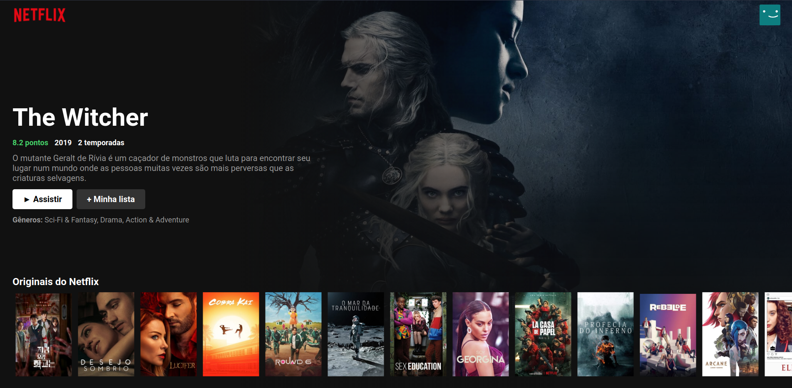

# <div align="center">Netflix Clone</div>



<p align="center">Direitos reservados à Netflix</p>

## 🛠️ Tecnologias

<ul>
  <li><a href="https://reactjs.org/">React</a></li>
  <li><a href="https://nodejs.org/en/">Node</a></li>
</ul>

## ⚙️ Requisitos

<ul>
  <li><a href="https://git-scm.com/">Git</a></li>
  <li><a href="https://nodejs.org/en/">Node.js</a></li>
  <li><a href="https://www.npmjs.com/">NPM</a></li>
</ul>

## 🚀 Instalação

```
$ git clone https://github.com/jeffersonximeness/netflix-clone.git

$ npm install
$ npm start
```

## 💡 Observação
<div>
    <p>As informações foram coletadas pela API do <a href="https://www.themoviedb.org/?language=pt-BR">TMDB</a>.</p>
    <p>Para que o projeto rode, é preciso criar uma API KEY no site da <a href="https://www.themoviedb.org/?language=pt-BR">TMDB</a> e colocá-la na variável api_key no arquivo env.js</p>
</div>
<br>
<p>A aplicação irá abrir localmente em <strong>http://localhost:3000</strong></p>
